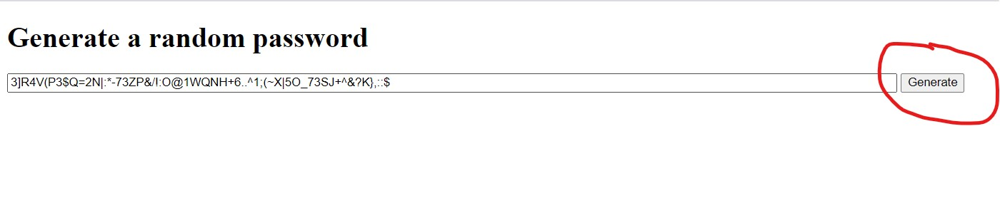

# passwordgenerator

Name: This application is a random password generator

Description and usage: This application will take user input on 5 criteria (Length, upper and lower case inclusion, numerical character inclusion, and special character inclusion). All of this will take place when a user clicks on the generate button on the screen to the right of the form. Once a user selects their criteria it will validate that at least one criteria in addition to length has been selected. After this the application will print into the form the user's randomly generated passcode with their selected length.

Visuals:  This image shows where you should click as a user (circled in red) to generate your passcode as well as showing the form with an example expected output.

Expected behavior of javascript code:

GIVEN I need a new, secure password 
WHEN I click the button to generate a password 
THEN I am presented with a series of prompts for password criteria 
WHEN prompted for password criteria 
THEN I select which criteria to include in the password 
WHEN prompted for the length of the password 
THEN I choose a length of at least 8 characters and no more than 128 characters 
WHEN prompted for character types to include in the password 
THEN I choose lowercase, uppercase, numeric, and/or special characters 
WHEN I answer each prompt 
THEN my input should be validated and at least one character type should be selected 
WHEN all prompts are answered 
THEN a password is generated that matches the selected criteria 
WHEN the password is generated 
THEN the password is either displayed in an alert or written to the page 